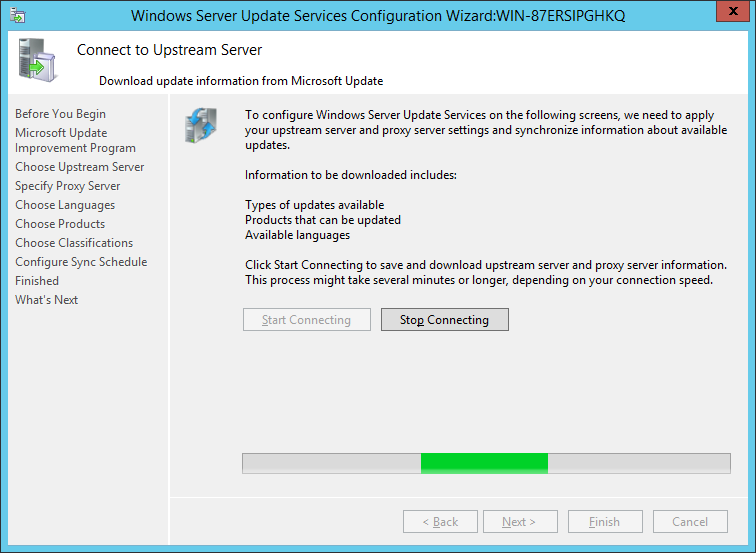
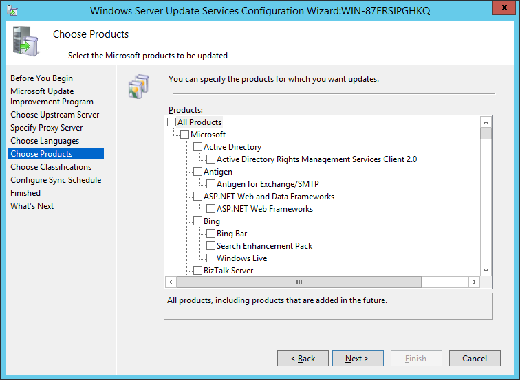
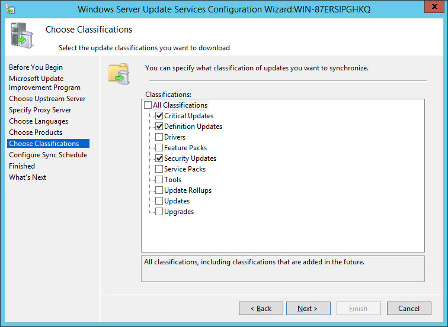
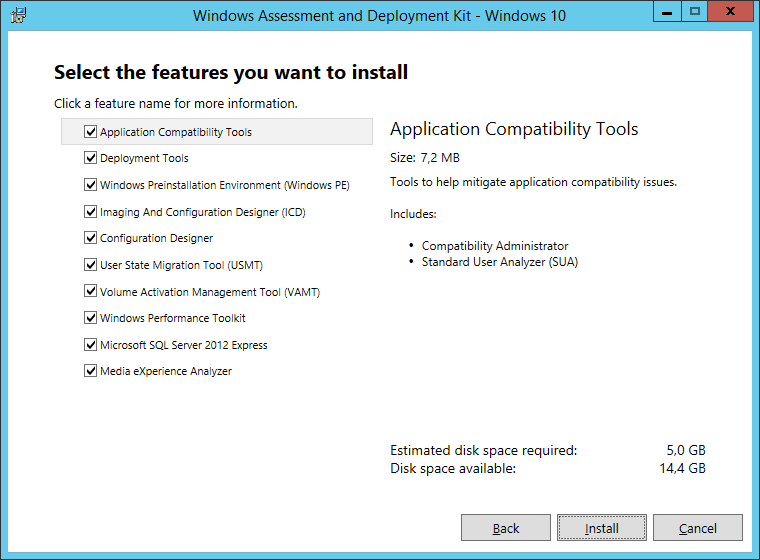
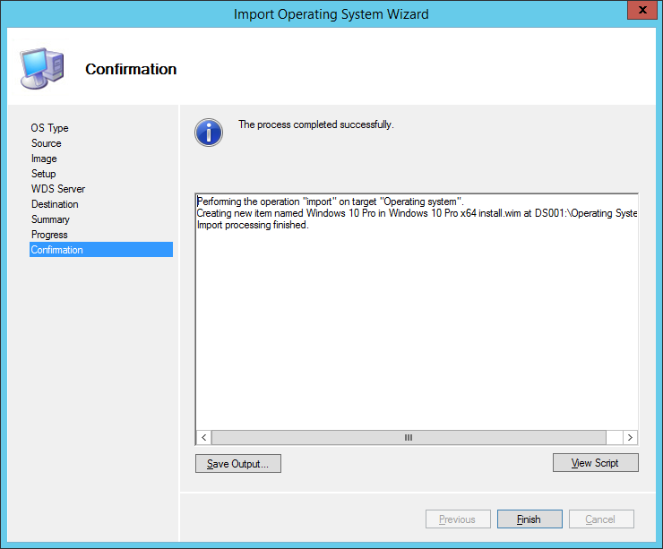

# Trabalho Prático - Administração de Sistemas e Serviços de Rede
## Cenário Proposto

Deverá ser implementado um	Solution	Accelerator baseado em	tecnologia	Microsoft	(MDT)
configurando em	modo	Zero	Touch	Instalation	(ZTI) instalando	o	seguinte	software:

- Microsoft Windows 10
- Microsoft Office 2016
- Adobe Reader
- Google Chrome
- Firefox

Os dados deverão ser compilado num	relatório com Print Screens das	configurações	e	dos
passos	efetuados	anexando	e	comentando	o conteúdo dos	ficheiros	**Bootstrap.ini** e
**CustomSettings.ini**.

## Instalação e Configuração do Servidor
**Notas iniciais**
>Todo este trabalho foi realizado num ambiente virtual de forma a facilitar a sua execução.

>Para igualmente facilitar a realização do trabalho, todas as Roles (AD, DHCP, WDS, etc..) foram instaladas no mesmo Windows Server, sendo que em ambientes produtivos seria aconselhável a sua separação conforme
necessário.


<div class="page-break"></div>

### Instalação do Active Directory


<div class="page-break"></div>

### Instalação do DHCP


<div class="page-break"></div>

### Instalação do Windows Server Update Services


<div class="page-break"></div>

### Configuração do Windows Server Update Services









<div class="page-break"></div>

### Instalação do Windows Assessment and Deployment Kit





<div class="page-break"></div>

### Instalação do Windows Deployment Services


<div class="page-break"></div>

### Configuração do Windows Deployment Services


<div class="page-break"></div>

### Instalação do Microsoft Deployment Toolkit


<div class="page-break"></div>

### Configuração do Microsoft Deployment Toolkit


Depois de criada a deployment share podemos começar adicionar os sistemas operativos e aplicações que pretendemos disponibilizar para os nossos deployments.

<div class="page-break"></div>

#### Importação do Sistema Operativo

> Para este caso vamos usar as sources do Windows 10. Se o nosso Sistema Operativo estiver em ISO, será necessário mountar numa drive primeiro.

Escolher a opção **Import Operating System**
<br>


Escolher a opção **Full set of operating system to add**
<br>


Indicar o caminho das sources do SO
<br>


Indicar o diretorio de destino
<br>


Rever as escolhas
<br>


Finalizar a importação
<br>


<div class="page-break"></div>

#### Adicionar Aplicações
Para este trabalho vamos adicionar as seguintes aplicações:
- Microsoft Office
- Adobe Reader
- Google Chrome
- Firefox

##### Microsoft Office
> Tal como na importação do SO, se o Office estiver em ISO, será necessário mountar numa drive primeiro.

Escolher a opção **New Application**
<br>


Escolher a opção **Application with Sources**
<br>


Identificar alguns detalhes da aplicação a adicionar
<br>


Escolher o diretorio com as sources
<br>


Indicar o diretorio de destino
<br>


Indicar o comando a executar para proceder a uma instalação *silenciosa*
No caso do Microsoft Office, basta colocar **setup.exe**. Mais tarde poderemos configurar opções de instalação
<br>


Rever as escolhas
<br>


Finalizar a importação
<br>


Sendo o Office uma apicação Microsoft, é possível efetuar algumas configurações extras.
Para isso basta aceder às propriedade da aplicação e no tabulador **Office Products** clicar no botão **Office Customization Tool**
<br>


Aviso a informar onde se deve gravar as configurações.
<br>


Escolha do Tipo de ficheiro que o office deve usar por omissão
<br>


Janela onde é possível efetuar todas as confirguarações permitidas no Office
Foram selecionadas algumas opções de forma a minimizar a interação do utilizador durante a instalação.
<br>


Gravar as configurações efetuadas no directori indicado.
<br>


<div class="page-break"></div>

##### Adobe Reader/Google Chrome/Firefox
A importação das restantes aplicações é semelhante à importação do Office. Apenas mudando a informação de identificação da aplicação e o comando para a *instalação silenciosa*

**Adobe Reader**
<br>


**Google Chrome**
<br>


**Firefox**
<br>


<div class="page-break"></div>

### Task Sequences
As task sequences permitem-nos definir determinados detalhes de configuração e execução que ocorrerão durante o processo de instalação. É aqui que poderemos definir as aplicações a instalar.

Criar uma nova Task Sequence
<br>


Identificamos a task sequence.
>O campo Task Sequence ID será usado mais tarde de forma a que durante a instalação seja esta a Task Sequence escolhida
<br>


O Template da nossa Task Sequence, neste caso basta escolher a opção **Standard Client Task Sequence**
<br>


O Sistema operativo onde esta Task ficara associada. Neste caso escolhemos o SO que importamos anteriormente.
<br>


Informações sobre a chave do produto
<br>


Algumas settings
<br>


Password para o user Administrator
<br>


Resumo da Task Sequence
<br>


Finalização
<br>


Para adicionar as aplicações a instalar escolhemos o ramo **Custom Tasks** e clicamos na opção **Add** > **General** > **Install Application**
<br>


Adicionamos todas as aplicações a instalar escolhendo das lista de aplicações importadas.
<br>


<div class="page-break"></div>

### Preparação das imagens de instalação
Antes procedermos a uma instalação ainda temos de configurar algumas coisas.

No Deployment Workbench temos de definir o conteudo do ficheiro CustomSettings.ini e do Bootstrap.ini

O conteúdo do Ficheiro CustomSettings.ini deve ser definido no tabulador Rules nas propriedades da Deployment Share.

Ainda no tabulador podemos definir o conteudo do ficheiro Bootstrap.ini clicando no botão **Edit Bootstrap.ini**

O conteúdo desdes ficheiros será descrito mais à frente.
<br>


Por fim temos de atualizar nossa Deployment Share.
<br>


Sem que alteramos o ficheiro Bootstrap.ini teremos de escolher a opção **Completely Regenerate the boot images**. Caso contrário poderemos usar a opção **Optimize the boot image updating process**
<br>


Após isto é necessário adicionar as boot images ao WDS
<br>


Para este exemplo vamos apenas adicionar a versão 64bits
<br>


Definimos o nome da boot image
<br>


Terminamos o processo.


Depois de todas estas configurações podemos iniciar o nosso processo de instalação do Windows 10.

Para isso criamos uma máquina virtual na mesma rede do nosso servidor.
Durante o boot a maquina irá procurar com um servidor DHCP e por uma boot image para que possa iniciar
<br>


caso tenhamos configurado mais que uma Boot image, é possível escolhar qual a que queremos usar. Tendo apenas uma este ecran não é apresentado.
<br>


Durante a instalação
<br>


A Finalizar a instalação
<br>


A instalar o Adobe Reader
<br>


Sumário final da instalação
<br>


<div class="page-break"></div>

### Os Ficheiros CustomSettings.ini e Bootstrap.ini

#### CustomSettings.ini
```
[Settings]
Priority=Init,Default
Properties=ComputerSerialNumber

[Init]
ComputerSerialNumber=#right(Replace(Replace("%SerialNumber%"," ",""),"-",""),12)#


[Default]
OSInstall=Y

SkipComputerName=YES
OSDComputerName=PC-%ComputerSerialNumber%


UserID=PGISCF\Administrator
UserPassword=password

AreaCode=21
CountryCode=351
Dialing=Tone
LongDistanceAccess=0

TimeZone=85
TimeZoneName=GMT Standard Time

BitsPerPel=32
VRefresh=75
XResolution=1024
YResolution=768

SkipLocaleSelection=YES
UserLocale=pt-PT
SystemLocale=pt-PT
UIlanguage=pt-PT
KeyboardLocale=0816:00000816
InputLocale=0816:00000816

UserDataLocation=NONE

SkipApplications=YES
SkipAppsOnUpgrade=YES

Applications001={0cb168a8-2984-4746-8afe-f24f773ad57d}
Applications002={fbd72fb0-7edb-4028-9f4a-a7a8de29f919}
Applications003={ac9f2941-4748-4b89-9ee0-bdfdf8a57f8f}
Applications004={288c15fc-6489-46bb-bf0f-5b08e0504a62}


SkipBitLocker=YES
SkipDeploymentType=YES


SkipDomainMembership=YES
JoinWorkgroup=PGISCF
_SMSTSORGNAME="Deploy via ISCF"

SkipPackageDisplay=YES
SkipTimeZone=YES
SkipUserData=YES
SkipSummary=YES

SkipTaskSequence=YES
TaskSequenceID=1


SkipCapture=YES
SkipAdminPassword=YES
SkipProductKey=YES

SkipBDDWelcome=YES
SkipFinalSummary=NO
FinishAction=NONE

EventService=http://WIN-87ERSIPGHKQ:9800
```

**[Settings]**

`Priority=Init,Default`
> Define a prioridade de execução das secções definidas.


*Properties=ComputerSerialNumber*
>Definição de uma propriedade que pode ser usada mais tarde. Funciona como uma variável.


**[Init]**

`ComputerSerialNumber=#right(Replace(Replace("%SerialNumber%"," ",""),"-",""),12)#`

>De forma a minimizar a interação com o utilizador, podemos usar propriedades do sistema em conjunto com algumas funções para obter um nome que possa ser único
<br>
Neste caso usamos a propriedade **SerialNumber** ao qual aplicamos algumas substituições de forma a evitar traços e espaços e truncamos a 12 caracteres


**[Default]**

`OSInstall=Y`
> Indica ao MDT que vamos instalar um SO

`SkipComputerName=YES`
> Avança a possibilidade de definir o nome do computador

`OSDComputerName=PC-%ComputerSerialNumber%`
> Definição do nome do computador
Neste caso usa uma prefixo “PC-“ seguido do valor da propriedade ComputerSerialNumber gerado na secção [Init]"

`UserID=PGISCF\Administrator`
> User com acesso à Deployment Share
`UserPassword=password`
> Password do user indicado em cima

`AreaCode=21`
> Código da Área de Localização

`CountryCode=351`
> Código do País

`Dialing=Tone`
> Tipo de Ligação para modems

`LongDistanceAccess=0`
> Nº de ligação para linhas exteriores

`TimeZone=85`
> Fuso Horário

`TimeZoneName=GMT Standard Time`
> Nome do Fuso Horário

`BitsPerPel=32`
> Definições de resolução de ecran

`VRefresh=75`
> Definições de resolução de ecran

`XResolution=1024`
> Definições de resolução de ecran

`YResolution=768`
> Definições de resolução de ecran

`SkipLocaleSelection=YES`
> Avança a escolha da Localização

`UserLocale=pt-PT`
> Definições de Localização do User

`SystemLocale=pt-PT`
> Definições de Localização do System

`UIlanguage=pt-PT`
> Idioma o User Interface

`KeyboardLocale=0816:00000816`
> Definição do Locale do teclado

`InputLocale=0816:00000816`
> Definição do Locale do teclado

`UserDataLocation=NONE`
> Se for necessário migrar informação do utilizador deve-se colocar o caminho onde se encontra essa informação.
<br>
NONE significa que não irá haver qualquer migração


Uma vez que queremos minimizar a interação do utilizador, mas queremos instalar algumas aplicações, fazemos Skip no ecran de escolhas das aplicações e definimos que aplicações devem ser instaladas.
<br>
Para indicar que aplicações queremos instalar, devemos usar a directiva Applications###, indicado a Application ID que pode ser obtida nas propriedades da aplicação

`SkipApplications=YES`
> Avança a possibilidade de se puder escolher quais aplicações a instalar

`SkipAppsOnUpgrade=YES`
> Avança a possibilidade de se puder escolher quais aplicações a atualizar

`Applications001={0cb168a8-2984-4746-8afe-f24f773ad57d}`
<br>
`Applications002={fbd72fb0-7edb-4028-9f4a-a7a8de29f919}`
<br>
`Applications003={ac9f2941-4748-4b89-9ee0-bdfdf8a57f8f}`
<br>
`Applications004={288c15fc-6489-46bb-bf0f-5b08e0504a62}`
> Definição das aplicações a instalar.

`SkipBitLocker=YES`
> Para não apresentar as definições do BitLocker

`SkipDeploymentType=YES`
> Para não apresentar as definições do tipo de deployment

`SkipDomainMembership=YES`
> Para não apresentar as definições do dominio

`JoinWorkgroup=PGISCF`
> Definição do Workgroup a que o sistema vai ficar associado

`_SMSTSORGNAME="IPVC"`
> Para definir o nome da organização

`SkipPackageDisplay=YES`
> Controla se durante a instalação é presentado alguma página de deployment de pacotes como por exemplo pacotes de idiomas

`SkipTimeZone=YES`
> Avança a possibilidade de definir o Fuso Horário

`SkipUserData=YES`
> Avança a possibilidade de definir a migração de dados existentes do utilizador

`SkipSummary=YES`
> Avança a apresentação do sumário antes de iniciar a instalação

`SkipTaskSequence=YES`
> Avança a possibilidade de escolher a Task Sequence

`TaskSequenceID=1`
> Para indicar qual a Task Sequence a usar

`SkipCapture=YES`
> Avança a possibilidade de usamos o sistema de Captura.

`SkipAdminPassword=YES`
> Avança a possibilidade de definir a password de Administrador

`SkipProductKey=YES`
> Avança a possibilidade de definir a chave do produto

`SkipBDDWelcome=YES`
> Para não mostrar o ecran de Boas Vindas

`SkipFinalSummary=NO`
> Mostra o sumário final após a instalação

`*FinishAction=NONE`
> Ação a executar no final da instalação.
NONE – Não faz nada"

`EventService=http://WIN-87ERSIPGHKQ:9800`
> Define o endereço onde o servidor de monitor do MDT está a executar.

#### Bootstrap.ini
```
[Settings]
Priority=Default

[Default]
DeployRoot=\\WIN-87ERSIPGHKQ\DeploymentShare$

SkipBDDWelcome=YES

UserID=PGISCF\Administrator
UserPassword=password

SkipLocaleSelection=YES
UserLocale=pt-PT
SystemLocale=pt-PT
UIlanguage=pt-PT
KeyboardLocale=0816:00000816
InputLocale=0816:00000816
```

**[Settings]**

`Priority=Default`
> Define a prioridade de execução das secções definidas. Neste caso só existe a Default

`DeployRoot=\\WIN-87ERSIPGHKQ\DeploymentShare$`
> Define o caminho da nossa Deployment Share

`SkipBDDWelcome=YES`
> Para não mostrar o ecran de Boas Vindas

`UserID=PGISCF\Administrator`
> User com acesso à Deployment Share
`UserPassword=password`
> Password do user indicado em cima

`UserLocale=pt-PT`
> Definições de Localização do User

`SystemLocale=pt-PT`
> Definições de Localização do System

`UIlanguage=pt-PT`
> Idioma o User Interface

`KeyboardLocale=0816:00000816`
> Definição do Locale do teclado

`InputLocale=0816:00000816`
> Definição do Locale do teclado <

<div class="page-break"></div>

## Conclusão
Apesar de bastante trabalhoso uma vez que para testarmos determinadas funcionalidades é necessário reinstalar todo um sistema operativo, este conjunto de ferramentas revelaram-se bastante poderosas para o deployment/reposição de maquinas.

Exite ainda bastante para explorar, como por exemplo o uso de PowerShell Scripts para automaticar determinadas tarefas, conversão para ISOs instalável ou até fazer uso do sistema de capture.

No final penso que consegui adquirir os conhecimento necessários para poder com mais alguma investigação e experimentação, implementar um sistema de deployment em produção.


```
Realizado por: Jorge Martins (jorgemfm@gmail.com)
Disciplina: Administração de Sistemas e Serviços de Rede
Processor: Paulo Vaz
Data: 28-02-2017
```
